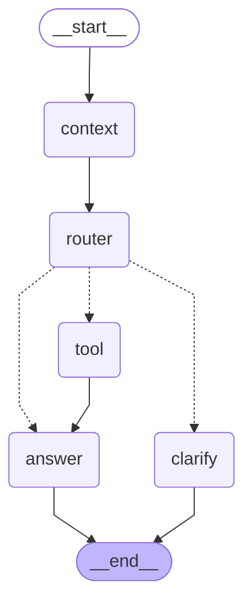

# LangGraph Mermaid Diagram

```mermaid
---
config:
  flowchart:
    curve: linear
---
graph TD;
	__start__([<p>__start__</p>]):::first
	context(context)
	router(router)
	tool(tool)
	answer(answer)
	clarify(clarify)
	__end__([<p>__end__</p>]):::last
	__start__ --> context;
	context --> router;
	router -.-> answer;
	router -.-> clarify;
	router -.-> tool;
	tool --> answer;
	answer --> __end__;
	clarify --> __end__;
	classDef default fill:#f2f0ff,line-height:1.2
	classDef first fill-opacity:0
	classDef last fill:#bfb6fc

```
