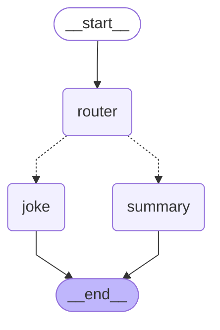

# LangGraph Mermaid Diagram

```mermaid
---
config:
  flowchart:
    curve: linear
---
graph TD;
	__start__([<p>__start__</p>]):::first
	router(router)
	joke(joke)
	summary(summary)
	__end__([<p>__end__</p>]):::last
	__start__ --> router;
	router -.-> joke;
	router -.-> summary;
	joke --> __end__;
	summary --> __end__;
	classDef default fill:#f2f0ff,line-height:1.2
	classDef first fill-opacity:0
	classDef last fill:#bfb6fc

```
