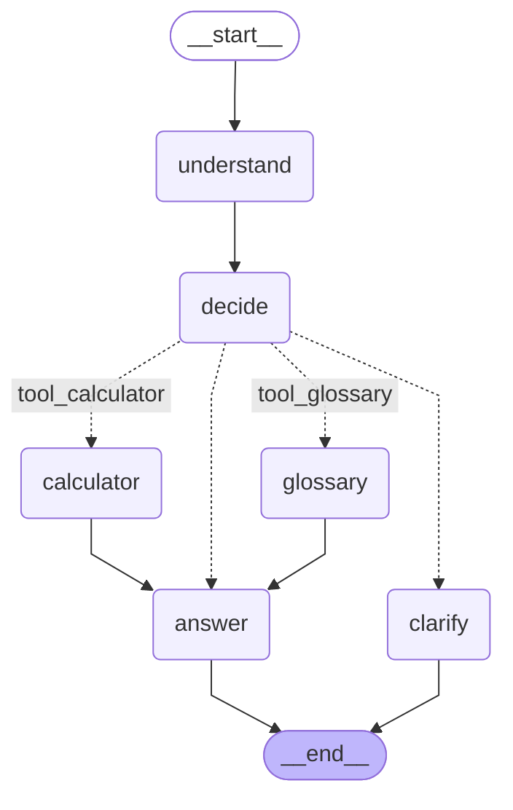

# Phase 6 Mermaid Diagram

```mermaid
---
config:
  flowchart:
    curve: linear
---
graph TD;
	__start__([<p>__start__</p>]):::first
	understand(understand)
	decide(decide)
	calculator(calculator)
	glossary(glossary)
	answer(answer)
	clarify(clarify)
	__end__([<p>__end__</p>]):::last
	__start__ --> understand;
	calculator --> answer;
	decide -.-> answer;
	decide -. &nbsp;tool_calculator&nbsp; .-> calculator;
	decide -.-> clarify;
	decide -. &nbsp;tool_glossary&nbsp; .-> glossary;
	glossary --> answer;
	understand --> decide;
	answer --> __end__;
	clarify --> __end__;
	classDef default fill:#f2f0ff,line-height:1.2
	classDef first fill-opacity:0
	classDef last fill:#bfb6fc

```
